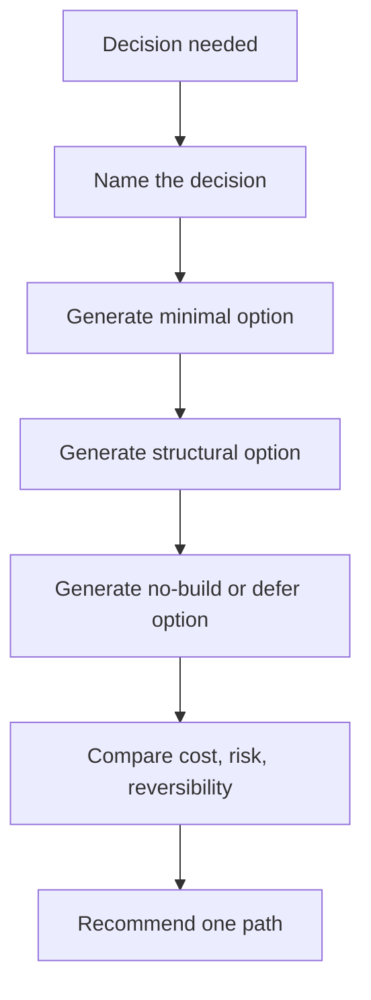

# Alternatives Before Code

Do not let the first plausible plan become the plan by default.

## When To Use

- The change affects architecture, data shape, workflow, or dependency choices.
- The agent or user has already latched onto one implementation.
- A refactor could be minimal, structural, or deferred.
- Reversibility and blast radius matter.

## Do Not Use For

- One-line fixes with obvious verification.
- Renames, formatting, or generated-file updates.
- Emergency mitigation where analysis would delay restoration.

## Decision Flow



## Anti-Patterns

| Novice move | Expert move | Why it matters |
| --- | --- | --- |
| Compare only implementation details | Compare reversibility, blast radius, and testability | The best code may be the wrong commitment |
| Treat no-build as laziness | Include defer/no-build as a real option | Sometimes the cheapest fix is not changing code |
| Pick the clever option | Prefer the option with the smallest sufficient surface | Future maintenance is part of the cost |

## Process

1. Name the decision being made.
2. Present three options: minimal, structural, and conservative/no-build.
3. Compare cost, reversibility, blast radius, testability, and cognitive load.
4. Recommend one option and say what would make you change your mind.

## Tooling

No external tools are required. Inspect code or ADRs when an option depends on existing architecture.

## Output Contract

```md
Decision:
Option A - Minimal:
Option B - Structural:
Option C - Conservative/no-build:
Recommendation:
Change-my-mind evidence:
```

If only one option seems viable, explain which constraint eliminated the others.

## Temporal Note

This skill encodes a durable reasoning workflow and contains no time-sensitive third-party technical claims. Last reviewed: 2026-05-25.
