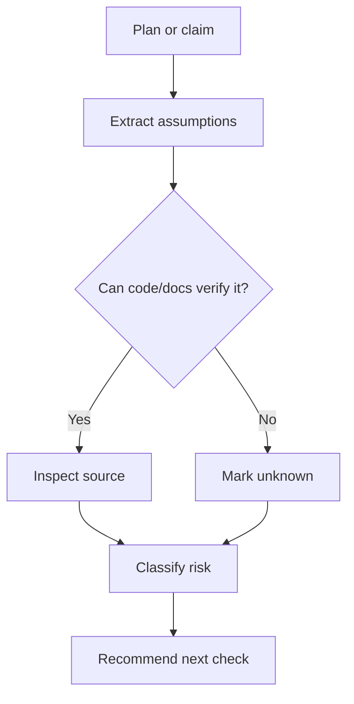

# Assumption Audit

Treat confidence as something to inspect, not something to inherit.

## When To Use

- A plan depends on claims that have not been checked.
- The user or agent says "obviously", "just", "safe", "simple", or "already handled".
- A design assumes behavior from an API, framework, runtime, or user workflow.
- AI produced a fluent answer without citing code, docs, tests, or logs.

## Do Not Use For

- Requirements already verified by tests, docs, or code references.
- Cosmetic changes with no behavioral or operational effect.
- Brainstorming where the user explicitly wants divergent ideas before evaluation.

## Decision Flow



## Anti-Patterns

| Novice move | Expert move | Why it matters |
| --- | --- | --- |
| Accept fluent AI output | Demand evidence from code, docs, tests, or logs | Fluency is not verification |
| Collapse risk into one concern | Classify assumptions by type and severity | Different risks need different checks |
| Ask the user everything | Inspect locally verifiable claims first | The codebase is often the best witness |

## Process

1. Extract assumptions from the request, plan, and code context.
2. Classify each assumption as factual, technical, product, operational, or social.
3. Mark each one as verified, likely, risky, or unknown.
4. Inspect code or docs for assumptions that can be checked locally.
5. Ask only for assumptions that cannot be checked and would change the work.

## Tooling

Use local code and docs search first. No dedicated script is required.

## Output Contract

```md
Verified:
Likely but unproven:
Risky:
Unknown:
Recommended next check:
```

Challenge at least one assumption unless all assumptions are already verified by code or docs.

## Temporal Note

This skill encodes a durable reasoning workflow and contains no time-sensitive third-party technical claims. Last reviewed: 2026-05-25.
