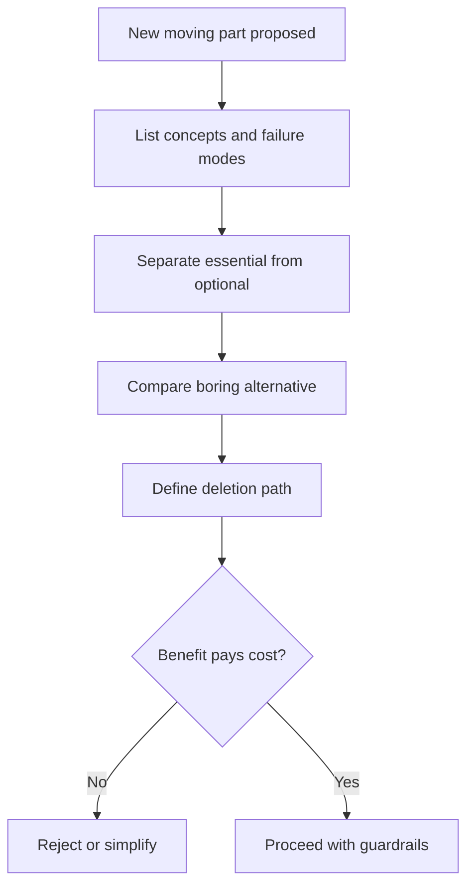

# Complexity Budget

Every moving part spends future attention. Make the spend explicit.

## When To Use

- A change adds a dependency, framework, queue, cache, state machine, agent, or new abstraction.
- A plan makes code more generic than the current need.
- The solution is hard to delete later.
- The team might pay operational cost after the author leaves.

## Do Not Use For

- Small local changes with no new abstraction.
- Deletion-only refactors that reduce moving parts.
- Architecture already justified by a current ADR.

## Decision Flow



## Anti-Patterns

| Novice move | Expert move | Why it matters |
| --- | --- | --- |
| Add abstraction for possible future needs | Buy only the complexity needed now | Speculative abstractions age poorly |
| Count implementation effort only | Count maintenance, operations, and deletion cost | Future attention is part of the budget |
| Hide complexity behind naming | Name each new state and failure mode | Unnamed complexity becomes surprise work |

## Process

1. List the new concepts, dependencies, states, and failure modes.
2. Identify which complexity is essential versus optional.
3. Compare with the boring solution.
4. Define the deletion path if the abstraction fails to pay for itself.

## Tooling

No external tools are required. Read existing ADRs before challenging accepted architecture.

## Output Contract

```md
New moving parts:
Essential complexity:
Optional complexity:
Boring alternative:
Deletion path:
Recommendation:
```

Prefer the boring alternative unless the added complexity buys a named capability or removes larger existing complexity.

## Temporal Note

Architecture cost changes as systems and teams evolve. Re-check this budget when ownership, traffic, or operational constraints change. Last reviewed: 2026-05-25.
