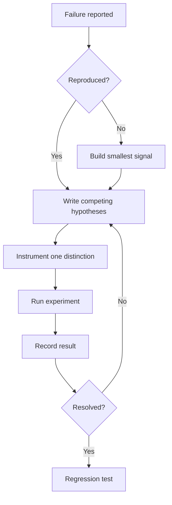

# Debugging Lab Notebook

Do not patch symptoms until the failure has a feedback loop.

## When To Use

- A bug is hard, flaky, or poorly understood.
- AI starts proposing fixes without a hypothesis.
- The failure crosses services, time, state, or concurrency boundaries.
- Negative findings need to be preserved.

## Do Not Use For

- Simple bugs that already have a failing test.
- Purely visual defects with an obvious screenshot reproduction.
- Incidents where immediate mitigation must happen before root-cause analysis.

## Decision Flow



## Anti-Patterns

| Novice move | Expert move | Why it matters |
| --- | --- | --- |
| Change code before reproducing | Build a fast signal first | Without a signal, fixes are guesses |
| Keep one favorite hypothesis | Track competing hypotheses | Confirmation bias wastes time |
| Ignore negative results | Record what was ruled out | Future debugging should not repeat dead ends |

## Process

1. Reproduce the issue with the smallest deterministic signal available.
2. Write competing hypotheses.
3. Add instrumentation that can distinguish between hypotheses.
4. Run one experiment at a time.
5. Record negative findings; they are part of the search space.

## Tooling

Use the repository's test runner, logs, debugger, or temporary instrumentation. Remove exploratory instrumentation before finalizing unless it is intentionally retained.

## Output Contract

```md
Reproduction:
Hypotheses:
Experiment:
Result:
Next hypothesis:
Regression proof:
```

If reproduction is impossible, define the next best observation point and explain the loss of certainty.

## Temporal Note

This skill encodes a durable debugging workflow. Incident timelines and dependency behavior are time-sensitive and should include concrete dates when recorded. Last reviewed: 2026-05-25.
