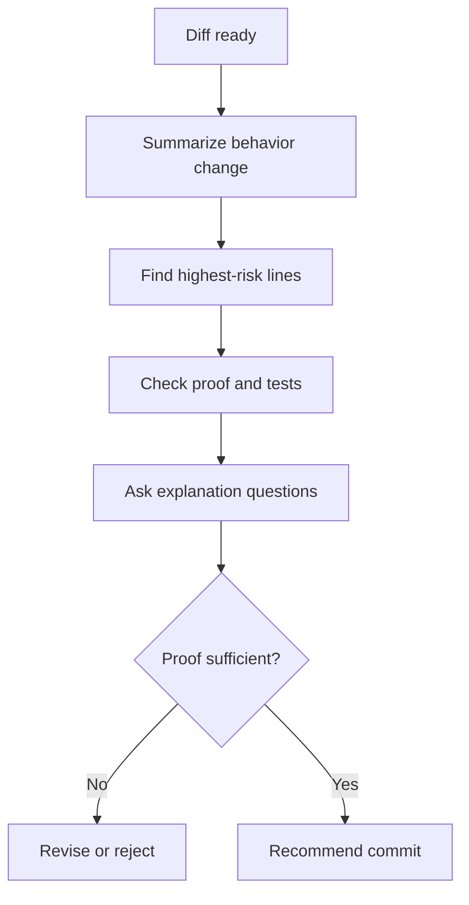

# Diff Interrogation

Treat every diff as a claim. Make it prove itself.

## When To Use

- A diff came from AI or heavy autocomplete.
- The change touches behavior, data, auth, permissions, persistence, or error handling.
- Tests are missing or only prove the happy path.
- The developer cannot explain every meaningful line.

## Do Not Use For

- Formatting-only diffs.
- Lockfile or generated artifact updates with separate verification.
- Diffs already reviewed after the latest changes.

## Decision Flow



## Anti-Patterns

| Novice move | Expert move | Why it matters |
| --- | --- | --- |
| Review file list | Review behavior change | Users experience behavior, not files |
| Trust passing tests blindly | Ask what the tests fail to cover | Tests can miss the new risk |
| Praise generated code first | Lead with findings | Review should surface risk before tone |

## Process

1. Summarize the behavior change, not the file list.
2. Identify the highest-risk lines.
3. Check for missing tests, widened permissions, silent failures, data loss, and hidden coupling.
4. Ask whether the developer can explain every changed line.
5. Recommend commit, revise, or reject.

## Tooling

Use `git diff`, `git diff --stat`, and targeted code search. No dedicated script is required.

## Output Contract

```md
Behavior change:
Highest-risk lines:
Missing proof:
Questions:
Recommendation:
```

Lead with findings. Avoid praise unless there are no issues.

## Temporal Note

This skill encodes a durable review workflow. Security and dependency implications may change over time; verify current advisories when relevant. Last reviewed: 2026-05-25.
