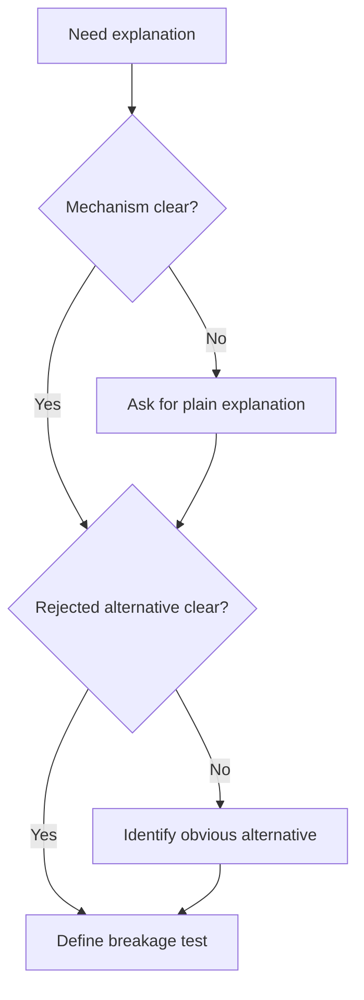

# Explain Without AI

The developer should be able to explain the work before shipping it.

## When To Use

- A diff was mostly AI-generated.
- A developer is learning a new API, library, or code path.
- The change is large enough that review needs a mechanism-level explanation.
- The developer can describe the outcome but not how it works.

## Do Not Use For

- Trivial edits where the mechanism is obvious.
- Generated artifacts that are validated elsewhere.
- Work with a recent thinking ledger that already explains mechanism and trade-offs.

## Decision Flow



## Anti-Patterns

| Novice move | Expert move | Why it matters |
| --- | --- | --- |
| Explain in buzzwords | Explain mechanism in plain language | Review depends on causal understanding |
| Say "AI generated it" | Own the explanation as the developer | Accountability cannot be delegated |
| Describe only the happy path | Name what would break if wrong | A real explanation is falsifiable |

## Process

1. Ask for or produce a concise explanation without rhetorical polish.
2. Include the actual mechanism, not just the outcome.
3. Explain why the selected approach is better than the obvious alternative.
4. Identify what would break if the explanation is wrong.

## Tooling

No external tools are required. Use code references when the explanation depends on a specific path.

## Output Contract

```md
Plain explanation:
Mechanism:
Rejected alternative:
Breakage test:
Confidence gap:
```

If the explanation is vague, ask one focused follow-up that forces a concrete mechanism.

## Temporal Note

This skill encodes a durable reasoning workflow and contains no time-sensitive third-party technical claims. Last reviewed: 2026-05-25.
