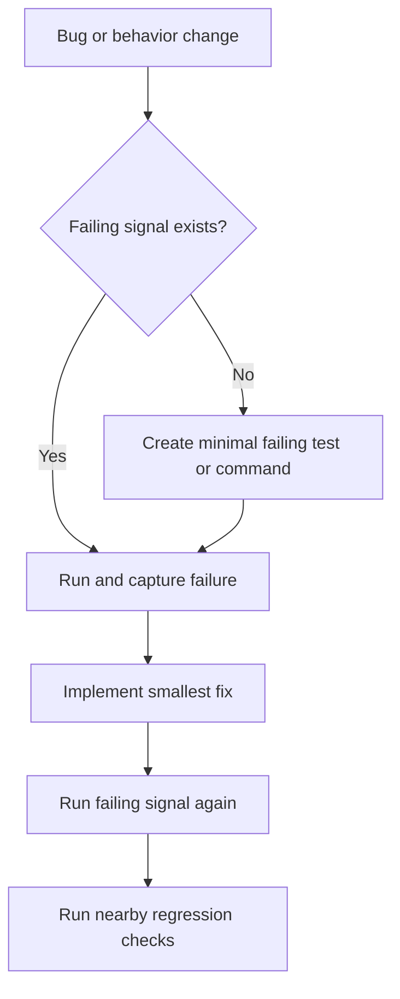

# Failing Test First

A fix without a failing signal is a guess with code attached.

## When To Use

- A bug fix is requested.
- New behavior needs acceptance proof.
- AI proposes code without demonstrating the existing failure.
- A regression could silently return.

## Do Not Use For

- Documentation-only edits.
- Snapshot or lockfile churn with separate validation.
- Emergency hotfixes where restoration matters more than the red step and a follow-up test is tracked.

## Decision Flow



## Anti-Patterns

| Novice move | Expert move | Why it matters |
| --- | --- | --- |
| Patch from intuition | Reproduce before editing | Reproduction turns debugging into a feedback loop |
| Test private internals | Verify behavior through public surfaces | Refactors should not break valid tests |
| Stop at the fixed case | Run nearby regression checks | Fixes can damage adjacent behavior |

## Process

1. Reproduce the failure manually or with an automated test.
2. Minimize the failing case.
3. Run the test or command and capture the failure.
4. Implement the smallest fix.
5. Re-run the failing check and a relevant regression set.

## Tooling

Use the repository's existing test command. If none exists, create the smallest repeatable command or script that fails before the fix.

## Output Contract

```md
Failing signal:
Command:
Expected failure:
Fix boundary:
Passing signal:
Regression checks:
```

If no automated test framework exists, state the fallback signal and its limits.

## Temporal Note

This skill encodes a durable reasoning workflow and contains no time-sensitive third-party technical claims. Last reviewed: 2026-05-25.
