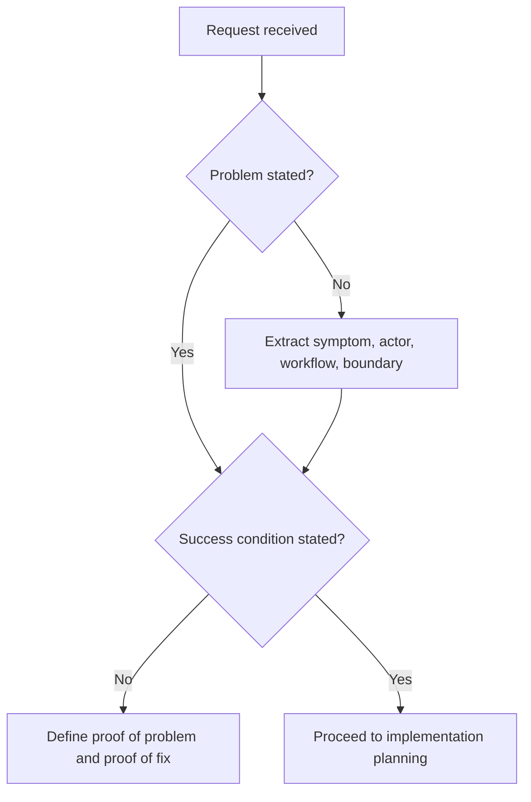

# Problem Framing

Do not implement until the problem is stated in operational terms.

## When To Use

- The user asks for code but has not defined the failure, workflow, actor, or success condition.
- The user proposes a solution and assumes the problem is already understood.
- A bug report lacks reproduction evidence.
- A feature request mixes goals, constraints, and implementation ideas.

## Do Not Use For

- Pure formatting or copy edits.
- Mechanical dependency bumps with clear acceptance checks.
- Tasks where a current issue, PRD, or failing test already frames the problem.

## Decision Flow



## Anti-Patterns

| Novice move | Expert move | Why it matters |
| --- | --- | --- |
| Start coding from the proposed solution | Restate the underlying problem first | The proposed solution may solve the wrong thing |
| Treat opinions as facts | Separate observed evidence from interpretation | Debugging depends on evidence |
| Define success as "it works" | Define a concrete verification signal | Reviewers need proof, not confidence |

## Process

1. State the user-visible symptom or desired capability.
2. Identify the affected actor, workflow, and boundary.
3. Separate facts from interpretations.
4. Define what evidence would prove the problem exists.
5. Define what evidence would prove the problem is solved.

## Tooling

No external tools are required. If code or docs can verify the frame, inspect them before asking the user.

## Output Contract

```md
Problem:
Current evidence:
Assumptions:
Non-goals:
Success condition:
First verification step:
```

If the user gave a solution instead of a problem, challenge it directly and recommend the narrower problem statement.

## Temporal Note

This skill encodes a durable reasoning workflow and contains no time-sensitive third-party technical claims. Last reviewed: 2026-05-25.
