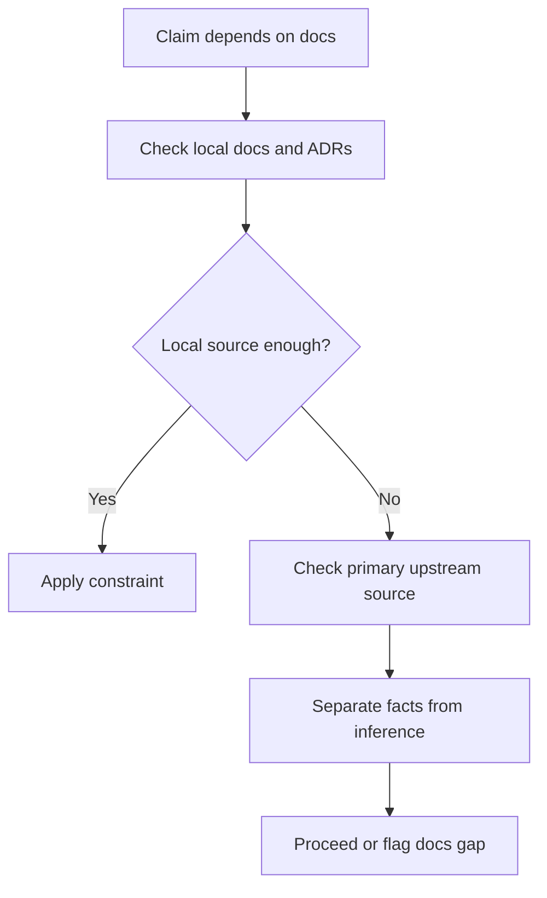

# Read The Docs First

Guessing is allowed only after the relevant source of truth has been checked or shown to be absent.

## When To Use

- The task depends on framework, API, CLI, or runtime behavior.
- The repo may already document the decision in `CONTEXT.md`, `docs/adr/`, schemas, or interfaces.
- The user states a rule, policy, or convention that may be outdated.
- AI proposes behavior without a primary source.

## Do Not Use For

- Purely local refactors whose behavior is fully determined by code.
- Tasks where the user supplied the authoritative source in the prompt.
- Cases where no docs exist and code is the only source of truth.

## Decision Flow



## Anti-Patterns

| Novice move | Expert move | Why it matters |
| --- | --- | --- |
| Guess framework behavior | Check official docs or source | APIs change and model memory drifts |
| Ignore ADRs | Read decisions before revisiting them | Reopening decisions accidentally creates churn |
| Present inference as fact | Label inference explicitly | Reviewers need to know what is proven |

## Process

1. Look for local `CONTEXT.md`, `CONTEXT-MAP.md`, `docs/adr/`, README files, schemas, and interface definitions.
2. For third-party behavior, prefer official docs or primary sources.
3. Record the exact source that constrains the work.
4. Distinguish documented behavior from inference.

## Tooling

Use local search first. Use web access only when the task depends on current external behavior or official upstream documentation.

## Output Contract

```md
Sources checked:
Relevant constraints:
Inference:
Docs gap:
Next action:
```

If docs contradict the user's plan, call out the contradiction before changing code.

## Temporal Note

External documentation can change. Record access dates for web sources and prefer current official sources when browsing is available. Last reviewed: 2026-05-25.
