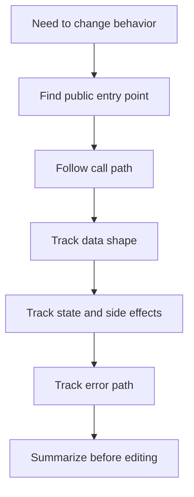

# Trace The Code

Do not reason about the system from memory when the code is available.

## When To Use

- The code path is unfamiliar.
- A plan depends on how current state, errors, or side effects flow.
- AI suggests a new path without showing the old one.
- A change crosses module boundaries.

## Do Not Use For

- Greenfield files with no existing callers.
- Pure documentation edits.
- Isolated changes where a recent trace already exists in the issue or thinking ledger.

## Decision Flow



## Anti-Patterns

| Novice move | Expert move | Why it matters |
| --- | --- | --- |
| Search for a filename and edit locally | Start from the public entry point | Local edits can miss caller contracts |
| Ignore error paths | Trace swallowed, transformed, retried, and surfaced errors | Bugs often live in failure handling |
| Trust AI's invented architecture | Verify real callers and data flow | The repository is the source of truth |

## Process

1. Locate the public entry point.
2. Follow calls to the state change or external effect.
3. Identify the data shape at each boundary.
4. Note where errors are swallowed, transformed, retried, or surfaced.
5. Summarize the path before proposing edits.

## Tooling

Use `rg` first for code search. Prefer file and line references over vague module names.

## Output Contract

```md
Entry point:
Call path:
Data shape:
State/external effects:
Error path:
Unknowns:
```

## Temporal Note

This skill encodes a durable reasoning workflow and contains no time-sensitive third-party technical claims. Last reviewed: 2026-05-25.
